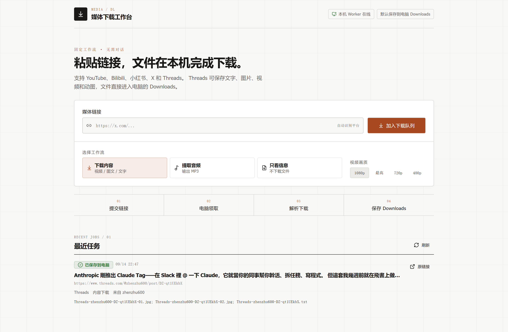

# lark-media-dl · 万能媒体工作台

以前下载 YouTube、B 站、小红书等平台的内容，我经常要换着用各种“万能下载器”和解析网站。有的平台能用，另一个就不行；今天能打开的网址，过几天又失效。

所以我把自己用的下载能力整理成了一个可以安装在自己电脑上的 **media-dl Skill**。让本地 Agent 帮忙查环境、装依赖、配置自己的账号和网络，文件直接进入 Downloads。再加一个可选的**妙搭网页工作台**：人在手机上贴链接，电脑上的后台自动领取并下载，日常不用再开 AI 会话。

这是个人部署的工具源码。每个人使用自己的电脑、配置与账号；作者不提供共用的下载后台。

<p>
<a href="https://www.youtube.com/"></a> <a href="https://www.youtube.com/">YouTube</a> &nbsp;
<a href="https://www.bilibili.com/"></a> <a href="https://www.bilibili.com/">Bilibili</a> &nbsp;
<a href="https://www.xiaohongshu.com/"></a> <a href="https://www.xiaohongshu.com/">小红书</a> &nbsp;
<a href="https://x.com/"></a> <a href="https://x.com/">X</a> &nbsp;
<a href="https://www.threads.com/"></a> <a href="https://www.threads.com/">Threads</a>
</p>

## 从个人下载开始

把仓库地址交给你的 Claude Code、Codex 或 Kimi，再说：

> 帮我按 README 和 docs/SOP-010-agent-install.md 安装 media-dl Skill。先调查这台电脑的环境和已有配置，默认下载到我的 Downloads，只配置我要用的平台。不要覆盖已有 Skill。用一条真实链接验证安装；我需要网页时再配置妙搭。

[让 Agent 完整安装与排错 →](docs/SOP-010-agent-install.md)

想自己装，也可以：

```sh
git clone https://github.com/zhenzoo/lark-media-dl.git
cd lark-media-dl
python scripts/bootstrap.py --apply
python scripts/install_skill.py --agent codex --apply
```

需要 Python 3.10+。Windows 用 `py` 或实际 Python 命令，macOS/Linux 通常用 `python3`。Claude Code 把最后一条改为 `--agent claude`；Kimi 或非默认 profile 使用 `--home` 指定核对过的配置目录。注册后重新打开 Agent 会话，已有同名 Skill 时脚本会保留原安装并提示处理。

安装脚本创建本仓 `.venv`。Windows 可以直接运行：

```powershell
.venv/Scripts/python.exe -m media_dl "公开的单条帖子或视频链接" --json
```

macOS/Linux 将解释器路径替换为 `.venv/bin/python`。支持 `--audio` 提取 MP3、`--meta-only` 查看信息、`--quality 720` 选择清晰度和 `-o` 指定目录。默认文件进入当前用户的 Downloads，同名文件自动避让，不覆盖已有文件。

默认视频下载会把画面和原音轨合为一个 MP4；仅 `--audio` 单独输出 MP3。FFmpeg 不可用或合并后缺少应有音轨时报告失败，不把两个分离文件当作成片交付。

**默认不需要飞书、OSS、大模型 API Key 或后台服务。** Threads 需要自己的 TikHub Key；其他平台按下表及真实下载结果补配置。配置模板是 [.env.example](.env.example)，具体注册和排错由 [安装引导](docs/SOP-010-agent-install.md) 带 Agent 逐项完成。

## 当前支持什么，需要哪些账号

| 平台 | 当前实现的内容 | Key / 登录状态 |
|---|---|---|
| YouTube | 单条公开视频、音轨 MP3、元数据 | 通常无 API Key；部分内容需本人有效登录；需要可用网络和 yt-dlp 支持的 JavaScript 运行环境 |
| Bilibili | 单条视频、音轨 MP3、元数据 | 通常无 API Key；清晰度及受限内容取决于账号已有权限 |
| 小红书 | 图文正文与图片、视频、可提取音轨、元数据 | TikHub 解析或公开页面路径；部分链接需完整分享参数或本人 Cookie |
| X | 公开视频、可提取音轨、视频元数据 | 当前通过 FxTwitter，无 X API Key；不包含纯文字、图片帖或多视频完整归档保证 |
| Threads | 正文 TXT、图片、图文、视频、动图；有音轨的视频可提取 MP3 | **需要有余额且开通接口权限的 TIKHUB_API_KEY**；无需 Threads Cookie 或 Meta 发帖 Token |

TikHub 是部分平台的解析服务，**不是整个项目唯一依赖**。Python、requests、yt-dlp 和 FFmpeg 负责实际下载与媒体处理。安装脚本处理 Python 依赖，Agent 再根据操作系统、网络与目标平台补齐必要项。

注册 [TikHub](https://tikhub.io/) 后把自己的 Key 存入用户配置；查 [官方文档](https://docs.tikhub.io/) 确认余额和权限。只有需要该服务的平台才配置，不要求所有人先充值。

“万能”是工作台名称，能力以上表为准。TikTok、抖音等尚未接入本仓；不承诺任意链接、会员/私密内容、整账号归档或所有平台的最高画质。平台接口变化可能使具体链接暂时失效，不能用封面图片冒充下载成功。

## 想直接贴链接，就加一个网页

```text
手机 / 电脑的妙搭网页
        ↓ 提交链接、查看状态
自己的妙搭云端：登录 + 任务队列
        ↑ 电脑主动领取和更新状态
电脑 Worker → 同一套 media-dl → Downloads
                                  └ 可选 OSS → 手机下载结果
```

**Skill 给 Agent 用，网页给人直接操作。** 下载核心相同。网页提交后，Worker 这个常驻 Python 程序主动连接云端，不需要开放家庭网络的入站端口，也不调用大模型。

默认 GUI 模式只把文件保存在电脑：即使手机打开网页提交任务，也不需要 OSS。想把完成的文件再下载到手机，才按需开启 OSS；多个文件提供 ZIP，电脑上仍保留平铺原文件。

启用 OSS 交付后，保持网页打开，本标签页提交的任务完成时会自动下载到当前设备，无需再次点击。单个视频直接取回 MP4；图文等本来包含多个文件的结果才打包。历史任务不会自动重下，浏览器阻止自动下载时仍可使用任务旁的手动入口。



截图来自本仓应用的独立部署验收。请部署自己的应用，不共用作者的后台 Key 或任务队列。

### 必须有飞书账号吗？

**个人 Skill 不需要；本仓提供的妙搭 GUI 需要。** 部署者需要自己的飞书账号和妙搭使用权限，当前网页接口要求登录，并建议只对本人开放。妙搭提供网页地址、后端和数据库，具体免费额度与可用范围以用户账号当时的规则为准。

可以使用自己的域名或其他托管服务，但本版 GUI 使用妙搭的登录和数据库 SDK。迁移时需要替换这些部分；只有一个域名或静态 `pages.dev` 页面，还不具备任务后台和持久化队列。当前没有 Cloudflare 一键部署适配器。详见 [架构和文件职责](docs/ARCH-010-user-journey.md)。

### 电脑要一直开着什么？

- **只用 Skill / 命令行**：下载时运行程序，结束后无需保留后台。
- **使用 GUI**：电脑已开机、已登录、联网、保持唤醒，Worker 持续运行。
- 锁屏、关闭显示器可以；睡眠、关机或断网时不能下载，任务会等电脑恢复。
- 不需要保持 AI 会话、飞书桌面客户端或网页一直打开。
- 自启动脚本实现的是**登录自启动**；“开机就能 work”还要满足登录、联网和不休眠。

[网页安装、自启动、状态检查与卸载 →](docs/SOP-010-agent-install.md)

### 手机取回是否必须依赖阿里云 OSS？

默认电脑下载完全不依赖 OSS。本仓已实现的远程文件交付使用部署者自己的 OSS，包含私有上传、临时签名链接和多文件 ZIP。需额外配置 Bucket、地域及专用访问凭据，费用由部署者承担。

妙搭自身有应用文件存储，当前 CLI 单文件上传上限为 100MB；它能作为后续适配方向，**本版尚未接入**，不能直接替换现有 OSS 配置。[官方文件存储说明](https://github.com/larksuite/cli/blob/main/skills/lark-apps/references/lark-apps-file.md)

签名链接过期与文件删除是两件事：链接默认 1 天失效，对象何时删除由用户设置 Bucket 生命周期。完整开通与验证步骤见 [安装引导](docs/SOP-010-agent-install.md)。

## 仓库里有什么

- `src/media_dl/`：可安装的 Python 下载包，CLI、平台适配、Worker 和可选 OSS。
- `skills/media-dl/`：给 Agent 的调用说明；使用同一个 Python 包。
- `scripts/`：安装、Skill 注册、登录自启动、状态检查、妙搭源码导出。
- `apps/miaoda/`：React 网页、NestJS 服务端、数据库 SQL、API 定义和构建脚本。
- `tests/` 与 `.github/workflows/ci.yml`：离线检查和三系统安装 CI。
- `assets/`：平台标识和真实工作台截图。

[逐文件架构说明](docs/ARCH-010-user-journey.md) · [安装与配置](docs/SOP-010-agent-install.md) · [实际验收记录](docs/LOG-010-release-validation.md)

无需 Link16、作者的个人 Skill 目录或作者的后台账号。Link16 等聊天桥可自行集成，日常 GUI 下载不依赖聊天桥。

## 开源与使用边界

项目自有代码按 [MIT License](LICENSE) 开源；依赖和品牌图标说明见 [THIRD_PARTY_NOTICES](THIRD_PARTY_NOTICES.txt)。媒体平台名称和标识用于说明兼容范围，不代表合作或授权。

安装个人 Skill 不会自动赋予内容下载或再传播的权利。请使用自己有权访问和保存的内容，遵守相应平台规则、版权和隐私要求；账号、网络、付费服务及用途由部署者自己选择。仓库不提供共享登录状态，不承诺绕过访问限制。
