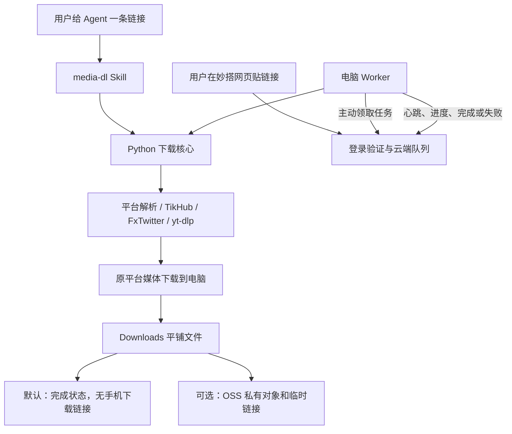

# 从使用者出发看模块和每个文件

## 用户下载一条链接时发生什么

只有一套下载核心。用户把链接给 Agent 时，Skill 的包装脚本调用 Python 包；用户在网页提交时，电脑 Worker 调用同一个包。平台解析先找到原始媒体地址，电脑再下载文件，完成后放到 Downloads。云端保存状态，不执行媒体解析。

正文保存 TXT；图片、视频、动图保留下载到的媒体格式；音频模式才转换 MP3。下载在临时目录完成后再交付，网络失败不把半成品声明为成功。同名文件用独占创建避让，重复任务可能生成第二份文件，不覆盖第一份。

## 第一层：拿到仓库、安装并调用

根目录文件：

- `README.md`：产品由来、平台能力、账号分类和三个入口：个人下载、网页、手机取回。
- `AGENTS.md`：任何本地 Agent 开工时的安装和验证边界。
- `CLAUDE.md`：Claude Code 入口，指向共享 AGENTS。
- `pyproject.toml`：Python 包元数据、基础依赖、可选 OSS 依赖和三个命令入口。
- `.env.example`：用户配置模板，没有真实值。
- `.gitignore`：排除环境文件、Cookie、缓存、依赖目录、构建产物和本地验收记录。
- `.gitattributes`：统一源码换行符，避免 Windows 检出后让 Linux 启动脚本带入 CRLF。
- `src/media_dl/media_output.py`：寻找并校验 FFmpeg，只接受 yt-dlp 后处理完成记录，核验成片视频与应有音轨；分离流不作为成片交付。
- `apps/miaoda/client/src/lib/auto-download.ts`：仅跟踪当前标签页提交的任务，完成后自动取回已提供链接的文件；保存等待状态、防止轮询重复和历史任务重下。
- `apps/miaoda/tests/auto-download.test.cjs`：当前设备、并发轮询、刷新恢复、失败降级与仅本地模式的下载行为验证。
- `tests/test_media_output.py`：缺失合并记录、无效 FFmpeg、真实音视频检查及忽略旧分离文件的回归验证。
- `LICENSE`：自有代码 MIT 许可证。
- `THIRD_PARTY_NOTICES.txt`：依赖、派生 UI、品牌标识的来源及许可说明。
- `.github/workflows/ci.yml`：Windows/macOS/Linux 安装和离线测试；另做妙搭类型检查、合同测试和构建。

用户会调用的脚本：

- `scripts/bootstrap.py`：预览或建立本仓虚拟环境，安装包并检查依赖；`--oss` 才安装 OSS。
- `scripts/install_skill.py`：向用户选定 Agent home 注册 Skill，保存安装清单，检测同名冲突/用户编辑；也负责卸载自己的文件。
- `skills/media-dl/SKILL.md`：教 Agent 分清下载、音频、信息查询，检查真实结果，处理网络、Key 和登录状态。安装时生成 `scripts/run.py`，绑定用户的实际 Python 环境。
- `scripts/startup.py`：生成 Windows Startup、macOS LaunchAgent 或 Linux systemd user 配置；安装、移除均有预览。
- `scripts/status.py`：读取后台最近一次成功心跳及 PID。
- `scripts/export_miaoda.py`：把明确的应用源码文件复制到用户自己的妙搭 Git 工作目录，不带私密环境或依赖。

## 第二层：本机下载核心

`src/media_dl/` 的每个文件：

- `__init__.py`：包版本。
- `__main__.py`：支持 `python -m media_dl`。
- `cli.py`：命令行参数和 JSON 结果，统一错误退出与敏感值遮蔽。
- `config.py`：用户配置优先级、FFmpeg 寻址和日志脱敏。
- `doctor.py`：依赖、代理/Key 是否配置、可选网络探测；连通不等于有下载权限。
- `downloader.py`：校验 URL、识别平台、选择工作流、管理临时下载和最终保存。
- `results.py`：文件名清理、平铺复制、同名避让。
- `delivery.py`：本地模式返回文件名；OSS 模式上传私有文件/ZIP 并生成临时链接。
- `worker.py`：轮询队列、校验任务、调用核心、刷新任务租约与电脑心跳、回传完成或失败；同一应用和电脑标识只能运行一个实例。
- `platforms/__init__.py`：平台适配包入口。
- `platforms/ytdlp.py`：YouTube、B 站、LinkedIn 以及 X 每条已解析视频地址共用的 yt-dlp 调用、Cookie、画质和音轨转换；`name` 参数固定输出文件名并隔离完成清单，供一帖多文件使用。
- `platforms/bilibili.py`：B 站公开下载所需匿名票据及本地缓存；不替代账号权限。
- `platforms/x.py`：通过 FxTwitter 解析整条推文，按发帖顺序保存全部视频、图片、动图与正文；音频模式对每个视频各提取 MP3。
- `platforms/xiaohongshu.py`：分享链接解析、TikHub/公开页面详情、图文/视频保存和音频提取。
- `platforms/threads.py`：TikHub 精确定位目标帖，处理纯文字、图集、视频和动图；API 与媒体连接分离，验证每个媒体地址。
- `platforms/linkedin.py`：免登录抓取公开帖页面，只解析主帖块（排除相关帖与评论）得到正文、作者、图片；视频交 `ytdlp.py`，音频从成片 MP4 提取并核验音轨。

新增平台应增加适配器，再同步 URL 识别、CLI、网页类型、测试与 README。不能只在平台列表里加个名字。

## 第三层：可选网页与队列

`apps/miaoda/` 是可以导出到自己妙搭应用的完整源码。

应用根目录：

- `package.json`、`package-lock.json`：依赖、版本锁和开发/验证/构建命令。
- `.env.example`：仅服务端 Worker Key 提示；用户自己通过妙搭获取其余私密运行配置。
- `.gitignore`：应用单独导出后仍排除环境、依赖和构建目录。
- `nest-cli.json`：NestJS 编译及路径映射。
- `tsconfig.json`：TypeScript 总入口；`tsconfig.app.json` / `tsconfig.node.json` 分别检查浏览器和服务器。
- `vite.config.ts`：妙搭前端构建预设。
- `tailwind.config.ts`、`postcss.config.js`：样式处理配置。
- `scripts/build.sh`：云端 shell 构建入口，转入 `build.cjs`。
- `scripts/build.cjs`：构建前后端、整理平台所需 HTML 路径、追踪并打包实际运行依赖；非可选缺包报错。
- `scripts/run.sh`：云端生产启动入口。
- `scripts/dev-local.js`：加载用户私密开发配置并启动本地前后端。
- `docs/openapi.json`：Worker 三个 HTTP 接口的 OpenAPI 索引，供配置 Key 权限。
- `shared/api.interface.ts`：网页与后端共用的任务、状态、请求和响应类型。
- `tests/contracts.test.cjs`：无需数据库的完成状态、错误输入和密钥校验合同检查。

浏览器文件：

- `client/index.html`：HTML 容器及平台上下文注入。
- `client/src/index.tsx`：React 挂载；`app.tsx`：工作台与提示容器。
- `client/src/pages/Jobs/index.tsx`：提交链接、选择内容/音频/信息、画质、近期任务、电脑在线状态、重试和可选文件下载。
- `client/src/api/jobs.ts`：通过妙搭客户端发请求并解包响应。
- `client/src/lib/utils.ts`：样式类名合并。
- `client/src/index.css`：全局样式；`tailwind-theme.css`：主题变量；`typography.css`：文字样式。
- `client/src/components/ui/alert.tsx`：提示；`badge.tsx`：状态；`button.tsx`：按钮；`empty.tsx`：空任务状态；`input.tsx`：输入框；`progress.tsx`：进度条。

服务器文件：

- `server/main.ts`：启动 NestJS、平台配置、HTML 渲染引擎与监听端口。
- `server/app.module.ts`：组合平台、业务和页面模块。
- `server/modules/view/view.module.ts`：页面模块；`view.controller.ts`：返回 HTML 和平台上下文。
- `server/modules/jobs/jobs.module.ts`：任务模块依赖装配。
- `server/modules/jobs/jobs.controller.ts`：要求用户登录的列表、提交、重试和电脑状态接口。
- `server/modules/jobs/jobs.openapi.controller.ts`：Worker 领取、心跳和状态更新接口。
- `server/modules/jobs/worker.guard.ts`：服务端验证 Bearer Key，缺失或错误时关闭入口。
- `server/modules/jobs/worker-context.interceptor.ts`：Key 验证通过后，为 Worker 请求建立本应用数据库服务身份。
- `server/modules/jobs/jobs.dto.ts`：输入字段的类型、长度和允许值验证。
- `server/modules/jobs/completion.ts`：下载完成必须有文件名，元数据查询不要求文件，本地完成不强制有 URL。
- `server/modules/jobs/jobs.service.ts`：排队、并发领取、状态转移、15 分钟超时回收、在线判断和数据映射。
- `server/database/001_initial.sql`：两张表、索引及行级访问策略。策略按当前应用 schema 匹配角色，不能把开发库的角色名写死到线上。
- `server/database/schema.ts`：Drizzle ORM 表映射和平台复合类型。
- `server/common/constants/api_response_code.ts`：错误码映射。
- `server/common/interfaces/api_response.interface.ts`：响应形状；`exception.interface.ts`：业务异常类型。
- `server/common/filters/exception.filter.ts`：统一错误响应；内部异常不把数据库堆栈交给浏览器。

### 数据和接口怎么衔接

`media_job` 保存原链接、平台、工作流、画质、状态、进度、电脑标识、文件名和可选交付 URL；`media_worker_runtime` 保存电脑标识、程序版本和最近心跳。不保存下载的二进制文件，不保存平台 Cookie 或 TikHub Key。

浏览器调用 `/api/jobs`（GET/POST）、`/api/jobs/:id/retry`（POST）、`/api/jobs/worker-status`（GET）。Worker 调用：

1. `GET /openapi/jobs/next?workerId=...`：按队列领取；条件更新防止两台电脑同时拿到同一条。
2. `POST /openapi/jobs/worker/heartbeat`：报告电脑在线。
3. `POST /openapi/jobs/update`：报告进度和结果，只允许当前领取者按有效状态转移更新。

任务经历 queued → claimed → downloading/inspecting → completed/failed；OSS 模式另有 uploading。Worker 下载较久时每 15 秒更新心跳和任务租约。电脑断线后任务不会凭空完成；超时回收由后续领取触发。

完成回执丢失时可能重试下载，所以不是“严格只执行一次”。本机同名避让保护已有文件。Worker 配置里 `MEDIA_WORKER_API_BASE` 保留应用完整路径，Key 放请求头，不允许跟随重定向。

## 第四层：维护、验证和可选扩展

- `tests/test_downloads.py`：平台和目标帖校验、文字/图集、文件碰撞、失败不交付、配置优先级、Worker 状态及重定向。
- `tests/test_installation.py`：重复注册、已有 Skill/用户编辑保护、卸载保留额外文件、三系统启动配置路径。
- `assets/logos/youtube.svg`、`bilibili.svg`、`xiaohongshu.svg`、`x.svg`、`threads.svg`：README 品牌标识，来源 Simple Icons；`linkedin.svg` 来源 Font Awesome Free（见 THIRD_PARTY_NOTICES）。
- `assets/screenshots/workbench.png`：独立部署后真实本地完成状态的截图。
- `docs/SOP-010-agent-install.md`：Agent 的环境调查、安装、Key/登录/网络、自启动、卸载与可选手机交付。
- `docs/LOG-010-release-validation.md`：实际执行的验收及未覆盖边界。
- `docs/PLAN-010-public-release.md`：首次发布的阶段与回执。
- `docs/release-copy.txt`：简短公开介绍草稿。

云端运行依赖妙搭 SDK；Python 核心不依赖飞书。自托管要替换云端身份与数据库绑定，维持上述队列合同。域名解决访问地址，静态网页解决界面，都不能单独替代动态接口和数据库。

OSS 是可选结果存储，跟平台解析无关。无需手机取回的用户保持 local。妙搭 100MB 文件存储交付和 Cloudflare 自托管都是尚未提供的适配方向，不出现在已实现开关里。
